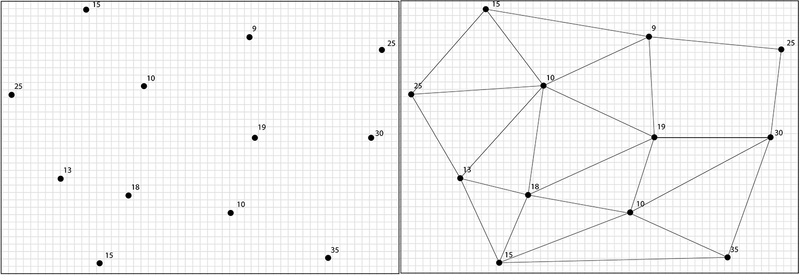

# Määrittelydokumentti

## Mitä algoritmeja ja tietorakenteita toteutat työssäsi 

Tarkoituksenani on toteuttaa lineaarinen interpolointialgoritmi, erityisesti spatiaalisen analyysin tarpeisiin. Haasteen tässä luo se, että interpoloinnissa kyettävät tunnetut arvot eivät ole siististi ruudukossa, kuten esimerkiksi kuvankäsittelyn tapauksissa usein on, vaan pisteet voivat sijaita mielivaltaisesti suhteessa toisiinsa. Lopputuloksena olisi tarkoitus syntyä kuva, jossa annettujen pisteiden rajaama alue on väritetty interpoloiduilla arvoilla.

Lähden ratkomaan ongelmaa ensin luomalla pisteistä [Delaunay triangulation](https://en.wikipedia.org/wiki/Delaunay_triangulation) menetelmää noudattaen verkon kolmioita. Jokaisen kolmion sisään jääville pikseleille lasken arvon [Barysentrisiä koordinaatteja](https://en.wikipedia.org/wiki/Barycentric_coordinate_system) hyödyntäen. Suunnittelemani toteutus vaatii myös jonkin nearest neighbor algoritmin toteutuksen, jotta jokaiselle pikselille voidaan löytää kolme lähintä tiedettyä mittausta. 

Käytettävät tietorakenteet päivittyvät vielä projektin edetessä, mutta pyrin käyttämään taulukoita mahdollisimman pitkälle, jo toteutuksen alkuvaiheesta alkaen. 

Menetelmän oikeellisuudesta minulla ei ole mitään varmuutta, mutta teoriassa uskoisin pääsevän melko lähelle todellisia interpolointituloksia. Tarkoituksenani olisi myös vertailla valmista lopputulosta esimerkiksi ArcGIS:llä tehtyihin interpolointeihin samoista aineistoista. GIS-järjestelmissä on myös käytössä melko paljon kehittyneemmät interpolointimenetelmät (kuten [Kriging](https://gisgeography.com/kriging-interpolation-prediction/)), joten voi olla myös mielenkiintoista vertailla näiden eroja. 

Alla havannollistettu algoritmin toimintaa, muodostettujen kolmioiden sisään jäävät pikselit täytetään interpoloiduilla arvoilla, kun kolmioiden kulmien arvot tiedetään:

## Mitä ongelmaa ratkaiset ja miksi valitsit kyseiset algoritmit/tietorakenteet

Tarkoituksena on interpoloida annetuista, satunnaisesti sijoitetuista mittauksista (scattered data) niiden rajaamalle alueelle arvoja. Paikkatieto kiinnostaa ja tämä olisi oiva mahjdollisuus yhistää paikkatietoja ja ohjelmointia. Lineaarinen interpolointi ja valitsemani menetelmät vaikuttivat myös matemaattisesti sopivan haastavilta, mutta ei kuitenkaan liian vaikeilta.

## Mitä syötteitä ohjelma saa ja miten näitä käytetään

Aineisto annetaan csv-tiedostossa, jossa mittaukset ja niiden koordinaatit.  Koordinaatit ainakin aluksi vain ETRS-TM35FIN muodossa, mutta mahdollisesti myöhemmässä vaiheessa tuki myös wgs84 desimaalimuodossa oleville koordinaateille. Periaatteessa koordinaatit voisi antaa mielivaltaisessa muodossa, mutta käytännön kannalta totetutan tuen, jollekin käytössä olevalle standardille. Lisäksi ohjelmalle annetaan parametrina resoluutio, jolla määritetään luotavan kuvatiedoston koko. Lopputuloksena olisi siis kuva, jossa on annettujen mittausten rajaamalle alueelle jokaiselle pikselille interpoloitu arvo. Lopputulos voi olla esimerkiksi mustavalkoinen tai arvoille voidaan myös antaa värit. Taustakartta ei luultavasti kuvaan saa lisättyä, koska ei ole välttämättä aivan triviaalia kohdistaa mittauspisteitä ja taustakarttaa oikein, jotta annetut mittaukset osuvat kartassa oikealle kohdalle. 

## Tavoitteena olevat aika- ja tilavaativuudet (m.m. O-analyysit)

Aikavaatimuksena olisi tavoitteena päästä O(n)-aikaan, joskin luultavasti algoritmin suoritus vaatii useamman O(n) aikasen silmukan. Vaihtoehtoisesti myös O(n^2) aika- ja tilavaatimuksella olevaan algoritmiin olisin tyytyväinen. Vaatimuksia on vielä tässä vaiheessa vaikea arvioida.   

## Lähteet

* https://codeplea.com/triangular-interpolation 
* https://www.scratchapixel.com/lessons/3d-basic-rendering/ray-tracing-rendering-a-triangle/barycentric-coordinates
* https://pdfs.semanticscholar.org/d7be/b4eabd3ea7108ff41135d87984a34c29ce7c.pdf
* https://team.inria.fr/titane/files/2017/03/barycentric.pdf
* http://www.cs.uu.nl/geobook/interpolation.pdf
* https://stackoverflow.com/questions/2902213/interpolation-of-scattered-data-what-could-i-do