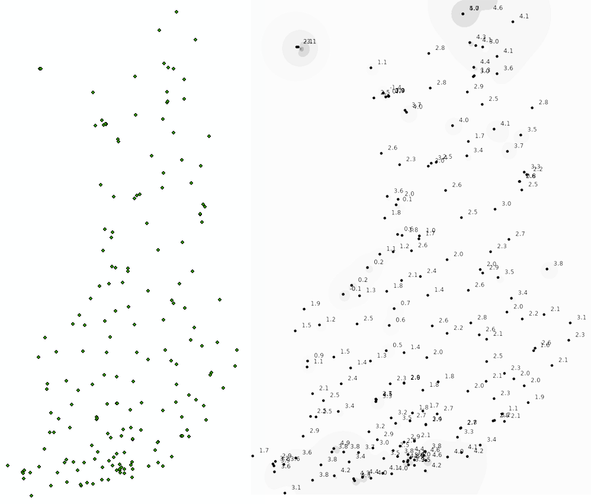
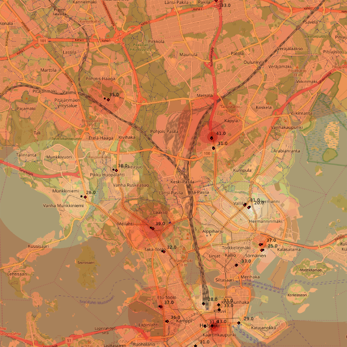
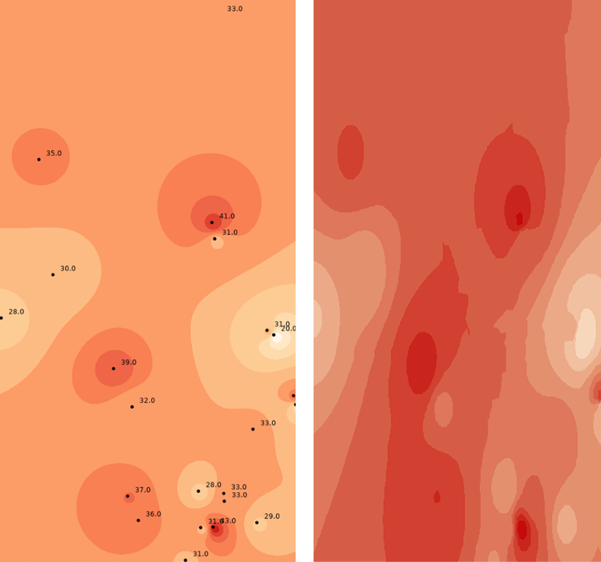

# Testausdokumentti

## Mitä on testattu, miten tämä tehtiin

Pyrin mahdollisimman kattavaan ykiskkötestaukseen Junit-testeillä.

TODO: Testasin myös ohjelman tuottamia tuloksia ArcGIS-ohjelmalla tehtyihin interpolointeihin samasta aineistosta ja vertailin näiden eroja. 

## Minkälaisilla syötteillä testaus tehtiin 

Interpoloinnin testiaineistona käytettiin ilmanlaatuaineistoa (22 pistettä) ja koko suomen kattavaa lämpötila-aineistoa (192 pistettä).

## Miten testit voidaan toistaa

JUnit testit voi ajaa komennolla

```bash
mvn test
```

Testipaketeista löytyy myös performance paketti, jossa on suoritettavia testejä tietorakenteiden suorituskyvyn testaamiseen.

## Ohjelman toiminnan empiirisen testauksen tulosten esittäminen graafisessa muodossa

Alla ohjelman tuloksia vertailtu ArcGIS-ohjelmistolla tehtyihin interpolointeihin. Aineistona on käytetty koko suomen kattavaa lämpötilamittauksia (ilmatieteenlaitos) ja ilmanlaatumittauksia Helsingissä (lähde).

### Pisteet suuressa mittakaavassa



Yllä olevasta kuvassa on vasemmalla ArcGIS-ohjelmalla lämpötila-aineiston aineiston pisteet kartalle ja oikealla algoritmini tuottama kuva, jossa pelkät pisteet. Kuvasta voi huomata, että pisteiden sijainnit vääristyvät hieman, kun ne luetaan tiedostosta ja asetetaan kuvaan. Tyydyn kuitenkin tähän tarkkuuteen, koska vääristyminen johtuu koordinaattien projektioista eikä sen korjaaminen vaikuta merkittävästi ohjelman toimintaa, lähinnä sen tarkkuuteen. 

### Pisteet pienessä mittakaavassa



Yllä olevassa kuvassa on päällekkäin ohjelmani tekemä kuva, jossa pisteet sekä taustakartta jossa on aineiston pisteet. Mustat pisteet ovat ohjelmani tekemiä pisteitä ja neliönmuotoiset pisteet ovat pisteiden todelliset sijainnit kartalla. Osan pisteiden sijainnit ovat hieman sivussa projektiovirheiden vuoksi, mutta tässä mittakaavassa vääristymä on huomattavasti pienempi kuin aiemmassa vertailussa.

### IDW-vertaiulu



Yllä olevassa kuvassa vasemmalla ohjelmani tekemä IDW-interpolointi ja oikealla ArcGIS-ohjelmalla tehty vastaava interpolointi Helsingin ilmanlaatumittauksista. Oikean puoleisessa kuvassa hieman eri parametrit ja hakukriteerit, mutta lopputulokset ovat kuitenkin melko samat.

## Testauksessa käytetty aineisto 

### Esimerkki koko Suomen lämpötilat kattavasta aineistosta

**n**|**e**|**temp**|**name**
-----|-----|-----|-----
60.30373|25.54916|4.6|Porvoo Kilpilahti satama
60.12467|19.90362|3.2|Jomala Maarianhamina lentoasema
59.77909|21.37479|3.8|Parainen Utö
59.95911|19.95374|3.6|Lemland Nyhamn
60.17824|19.98686|2.9|Jomala Jomalaby
60.30098|19.13142|1.7|Hammarland Märket
59.50454|20.34748|3.1|Kökar Bogskär

### Esimerkki Helsingin ilmanlaatuaineistosta

 | | | |**n**|**e**| |**value**
-----|-----|-----|-----|-----|-----|-----
Hämeentie 7| Helsinki| Finland|60.181574|24.955299|success|33
Mannerheimintie 57-59| Helsinki| Finland|60.1903|24.915794|success|39
Kehä I| Helsinki| Finland|60.243998|24.945843|success|33
Hämeentie 84-90| Helsinki| Finland|60.195236|24.961124|success|20


# Omien Math-metodien testaus 

## pow(double a, double b)

Testaus tehtiin testaamalla metodia syötteellä `2^i`, jossa i on kahden desimaalin tarkkuudella luku välillä -20 – 20.

`pow(double a, double b)` metodin testauksen tulokset: 

|   |   |
|--|--|
|Ero keskimäärin|0.000000000093|
|Oman toteutuksen aika|6.6611ms|
|Java toteutuksen aika|0.0009ms|
|Mitattujen aikojen ero|6.6602ms|
|Testiajoja|4000 kpl|

Oman liukulukuja käyttävän pow-metodin toteutuksen rahat tulivat vastaan noin 2^33, jolloin alkoi tulla yli 0.0001 virheitä lopputulokseen.

## pow(double a, int b)  

Testaus tehtiin testaamalla metodia syötteellä i^(int) i, jossa i on kahden desimaalin tarkkuudella luku välillä -20 – 20 ja (int) i on kokonaislukuesitys tästä juoksevasta liukuluvusta. 

`pow(double a, int b)` metodin testauksen tulokset:

|   |   |
|--|--|
|Ero keskimäärin|0.141670863082|
|Oman toteutuksen aika|0.000717ms|
|Java toteutuksen aika|0.001705ms|
|Mitattujen aikojen ero|0.000988ms|
|Testiajoja|15 kpl|

TODO: Parempi tarkkuus, raja nyt n 13^13

## sqrt(double a)
sqrt(double a) metodin testauksen tulokset

Testaus tehtiin  testaamalla metodia syötteellä sqrt(i), jossa i on luku 0 – 2 000 000 välillä kahden desimaalin tarkkuudella

|   |   |
|--|--|
|Ero keskimäärin|0.000000000000|
|Oman toteutuksen aika|0.000122ms|
|Java toteutuksen aika|0.000021ms|
|Mitattujen aikojen ero|0.000100ms|
|Testiajoja|200 000 000 kpl|

Metodi vaikuttaisi toimivan oikein myös hyvin suurilla luvuilla.

## Tietorakenteiden suorituskykytestaus

Testit suoritettu ajamalla kutakin testiä 30 kertaa ja laskemalla näiden suoritusajoista keskiarvo. `indexOf()` ja `contains()` metodien testiaineisto on satunnaisia lukuja määrätyltä väliltä, muut metodit testattu suurusjärjestyksessä olevalla aineistolla.

Yleisesti testituloksissa oli melko suuria vaihteluja eri testikertojen välillä, joten testitulokset ovat melko suuntaa antavia.

### ArrayList -toteutus

|metodi|oman toteutus|Javan toteutus|listan koko|
|--|--|--|--|
|add()|200ms|80ms|1 milj
|remove()*|10ms|1000ms| 50 000
|remove()**|650ms|60ms| 50 000
|indexOf()|747ms|726ms|30 000

\* Poistaminen tehty listan lopusta   
\** Poistaminen tehty listan alusta

`get()` ja `set()` metodeja ei vertailtu, koska molemmat käytännössä O(1) aikaisia toteutuksia.

### HashSet -toteutus

|metodi|oman toteutus|Javan toteutus|listan koko|
|--|--|--|--|
|add()*|44ms|22ms|100 000
|remove()|21ms|12ms|500 000
|contains()|36ms|26ms|500 000

Käänteisessä järjestyksessä poisteetuna nopeudessa ei merkittävää eroa.

\* Testituloksissa suuria vaihteluja, noin 100 000 kokoisella listalla suoritusajat alkoivat pysyä samana (suuremmilla heittelee)
