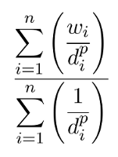

# Toteutusdokumentti

# Ohjelman yleisrakenne

Ohjelma interpoloi kuvan käyttäjän antamista pisteistä kahdella eri menetelmällä. Pisteet luetaan csv-tiedostosta ja interpoloi niistä matriisin, jonka kirjoittaa tiedostoon. Interpoloidut arvot luokitellaan [equal interval](http://wiki.gis.com/wiki/index.php/Equal_Interval_classification) menetelmällä ja näille luokille määritellään väriarvot käyttäjän haluamalla väriteemalla. Luokittelemalla interpoloidusta kuvasta saa hieman pelkistetymmän ja erityisesti idw-interpoloinnissa miellyttävämmän näköisen.

## Luetut pisteet ja koordinaatit

Luettujen pisteiden koordinaatit täytyy olla WGS84 datumissa ja desimaalimuodossa. Tämän päätin vaihtaa määrittelydokumentaation ETRS-TM35FIN koordinaatistosta, koska löysin kuitenkin enemmän WGS84-koordinaatistossa olevaa testausmateriaalia. Tähän teen vielä mahdollisesti apuvälineen, jolla muuttaa suomen koordinaatiston koordinaatteja WGS84 koordinaateiksi. 

Luetut koordinaatit täytyy muuttaa koordinaateiksi matriisissa, jonka korkeuden ja leveyden käyttäjä on määritellyt. Tämän toteutin [Haversinen kaavalla](https://en.wikipedia.org/wiki/Haversine_formula), jolla saavutetaan noin 0.5% tarkkuus. Koska luetut pisteet ovat maantieteellisiä koordinaatteja ei niiden välisiä etäisyyksiä voi laskea, kuten tasokoordinaatistossa käyttäen Pythagoraan lausetta.

Kun koordinaatit ovat luettu, täytyy ne siirtää matriisiin oikeille paikoille siten, että kun pisteiden ympärille piirretään suorakulmio ([minimum bounding box](https://en.wikipedia.org/wiki/Minimum_bounding_rectangle)), on sen vasen yläkulma matriisin ensimmäisessä elementissä, eli kohdassa (0,0). Tämän jälkeen koordinaatteja skaalataan siten, että ne täyttävät pituus tai leveyssuunnassa koko matriisin. Tässä on tärkeä huolehtia, että pisteiden väliset suhteet (aspect ratio) pysyvät samana.

## Interpolointi

Toteuttamani Delaunay-kolmiointi on naiivi toteutus ja se vain käy pisteitä läpi, kunnes löytyy validi Delaunay-kolmio. Toisin kuin määrittelydokumentissa, ohjelma laskee ensin pisteistä kolmiot ja tallentaa ne HashSet-tietorakenteeseen. Valitsin hajautustaulun kolmioiden tallentamiseen, koska siinä ei tarvitse huolehtia onko jo vastaava kolmio lisätty.

Delaunay-kolmion oikeellisuus tarkistetaan laskemalla kolmion keskipiste [(circumcenter)](http://mathworld.wolfram.com/Circumcenter.html) ja tarkistamalla jääkö ympyrän sisään ylimääräisiä pisteitä. Kolmion keskipiste lasketaan ottamalla kaksi kolmion sivua ja laskemalla näille suorille normaalit, jotka kulkevan sivujen keskikohdan läpi. Kolmion keskipiste on kohta, jossa nämä kaksi suoraa leikkaavat ja pisteen ympärille tehtävän ympyrän säde on etäisyys kolmion kärkeen. Kolmioinnin aikana pisteet käydään melko moneen kertaan läpi, mutta en myöskään tähän hätään keksi miten asian voisi hoitaa tehokkaammin.

Kolmioinnin jälkeen jokaiselle kuvan pisteelle lasketaan arvo etsimällä kolmio, jonka sisällä piste on ja kolmion kärkien arvojen avulla pisteelle lasketaan arvo käyttäen barsysentrisiä koordinaatteja.

IDW-interpolointi on huomattavasti simppelempi. Tässä menetelmässä lasketaan jokaisen kuvan pikselin kohdalla ennalta määritetyn hakuetäisyyden sisään jäävien pisteiden käänteisiä etäisyyksiä seuraavan kaavan mukaan:

jossa *n* on hakualueen sisään jäävien pisteiden määrä, *w* on tunnetun pisteen arvo ja *d* etäisyys nykyisestä pikselistä tunnettuun pisteeseen.

Eli mitä lähempänä tunnettu piste on nykyistä pistettä, sitä suurempi painoarvo sillä on. Etäisyydet korotetaan potenssiin *p*, joka on yleensä yhden ja kahden väliltä. Tämä tasoittaa tunnettujen pisteiden ympärille muodostuvia huippuja, mitä pienempi p-arvo, sitä jrykempi huippu muodostuu tunnetun pisteen ympärille.

## Tietorakenteet

Toteutin työssä ArrayList- ja HashSet-tietorakenteet. Näihin olen toteuttanut oleellisimmat metodit jotka Javan valmiit toteutukset tarjoavat. HashSetiin on lisäksi tehty Iterable-toteutus, jotta tietorakenteen koko sisällön voisi käydä läpi helposti. Koin järkevämmäksi toteuttaa Iterable-rajapinnan kuin alkaa korvata sitä omalla, näin saadaan tuki myös javan `for(int i : set)` syntaksille. ArrayListiin tätä ei ole toteutettu koska, saman voi tehdä helposti `size()` ja `get()` metodeilla.

# Saavutetut aika- ja tilavaativuudet (m.m. O-analyysit pseudokoodista)

Delaunay kolmoiden muodostaminen on tällä hetkellä O(n^3) aikainen, mutta tämä suoritetaan vain kerran interpoloinnin aikana. Algoritmiin on nopeampia ratkaisuja olemassa, mutta en toteuttanut niitä koska ne eivät ole aivan triviaaleja toteuttaa ja Delaunay kolmiointi on vain yksi pieni osa ohjelmaani.

Interpoloinnin vaatima aika on vahvasti sidoksissa kuvan resoluutioon, koska jokaiselle pikselille täytyy laskea arvo. Tällöin luettujen pisteiden määrällä ei ole suurta vaikutusta, jos ne pysyvät alle noin viidenkymmenen. Tätä suurempi määrä pisteitä hidastaa kolmioilla interpolointia, mutta IDW-interpolointi pysyy suhteellisen nopeana.

# Suorituskykyvertailu

Alla vertailua ohjelman suoritusajoista, kun käytössä javan Math-luokan metodit ja itse toteutetut vastaavat metodit. Kaikki testit suoritettu 1000x1000px kuvalla.

**Kolmioilla interpolointi:**

**Aineisto**|**Javan aika**|**Oma aika**
|--|--|--|
|22 pistettä|1195ms|1323ms|
|192 pistettä|32s|33s|

**IDW-interpolointi:**

**Aineisto**|**Javan aika**|**Oma aika**
|--|--|--|
|22 pistettä|364ms|1323ms|
|192 pistettä|1561ms|15s|

Kolmioilla interpoloidessa aijoissa ei ole suuria eroja, mutta IDW-interpoloinnissa ero muodostuu oman pow() metodini hitaudesta. Yleisesti IDW-interpolointi on nopeampi, mutta ero voisi tasoittua jos Delaunay-kolmionti olisi nopeampi.

Tähän aikavertailua kolmioilla ja idw interpoloinnilla. Ainkain:
* Monta pistettä kolmiointi
* Monta pistettä idw
* Vähän pisteitä kolmiointi
* Vähän pisteitä idw

Kaikki kun kuva on 1000x1000px ja 100x100px

# Työn mahdolliset puutteet ja parannusehdotukset

Puutteita työssäni on muutamia. Ehkä näkyvimpänä on luettujen pisteiden sijainnin vääristyminen. Vääristymä on kuitenkin sen verran pientä, etten ala parantaa sen tarkkuutta. Myös toteuttamani potenssifunktiot voisivat olla tarkempia. Tyydyn kuitenkin noin neljän desimaalin tarkkuuteen. Ohjelmassani ei ole tarvetta käyttää suuria exponentteja tai muuten valtavan suuria lukuja, joten tarkkuuden hiominen ei tässä tuo merkittävää lisäarvoa ohjelman toimintaan.

En toteuttanut Math-luokan sin-, cos- tai asin-metodeja. Näiden toteutus olisi luultavasti ollut mahdollista, mutta niiden tarve ilmeni vasta työn melko loppuvaiheilla, joten en käyttänyt näihin aikaa. Toteutus olisi kuitenkin ollut myös [hyvin matemaattinen](https://stackoverflow.com/questions/2284860/how-does-c-compute-sin-and-other-math-functions/14869358#14869358) ja osaamisalueeni ulkopuolella, joten olisin tarvinnut huomattavasti enemmän aikaa metodien toteuttamiseen siten, että myös ymmärrän mitä niissä tapahtuu.

# Lähteet

* https://stackoverflow.com/questions/2284860/how-does-c-compute-sin-and-other-math-functions/14869358#14869358
* http://jonisalonen.com/2012/converting-decimal-numbers-to-ratios/
* https://helloacm.com/newton-iterative-sqrt-method/
* http://colorbrewer2.org/
* http://wiki.gis.com/wiki/index.php/Color_scheme